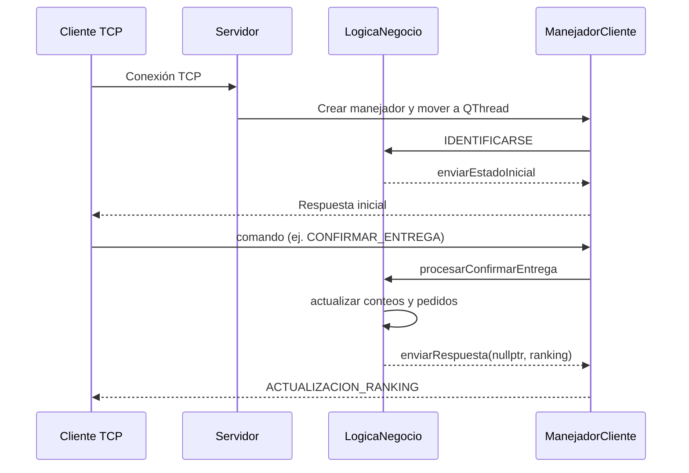

# Módulo Servidor - Altokepe

## Tabla de Contenidos
1. [Resumen Ejecutivo](#resumen-ejecutivo)
2. [Arquitectura General](#arquitectura-general)
3. [Patrón Observer](#patrón-observer)
4. [Patrón Facade](#patrón-facade)
5. [Patrón Repository](#patrón-repository)
6. [Patrón Command](#patrón-command)
7. [Implementación del Servidor](#implementación-del-servidor)
8. [Protocolo de Comunicación](#protocolo-de-comunicación)
9. [Decisiones de Diseño](#decisiones-de-diseño)
10. [Diagrama de Secuencia](#diagrama-de-secuencia)
11. [Conclusiones](#conclusiones)

---

## Resumen Ejecutivo

Este documento describe la implementación del **Servidor Qt TCP** que coordina a todos los actores del sistema Altokepe: Recepcionista, Manager/Chef, Estaciones de Cocina y pantallas de Ranking. El módulo aplica patrones de diseño para desacoplar transporte de negocio, difundir cambios en tiempo real y mantener la coherencia del estado compartido.

### Objetivos Cumplidos
- Conexiones TCP concurrentes con un hilo dedicado por cliente
- Difusión en tiempo real de cambios de pedidos y ranking
- Filtrado de broadcasts según el tipo de actor
- Facade para entregar estados listos para consumir por los clientes
- Thread-safety en repositorios de menú, pedidos y ranking

---

## Arquitectura General

- **Servidor (`Servidor`)**: acepta conexiones (`incomingConnection`), crea un `ManejadorCliente` por socket y lo mueve a su propio `QThread`.
- **Manejador de cliente (`ManejadorCliente`)**: lee mensajes JSON delimitados por `\n`, identifica rol vía `IdentificadorCliente` y despacha comandos con `CommandFactory`.
- **Lógica de negocio (`LogicaNegocio`)**: singleton thread-safe que centraliza menú, pedidos, colas y conteos de ranking; emite respuestas/broadcasts con `enviarRespuesta`.
- **Repositorios (`repository/`)**: encapsulan persistencia en memoria de menú y pedidos para aislar la lógica del detalle de almacenamiento.

---

## Patrón Observer

### Definición
Permite que múltiples observadores sean notificados cuando el sujeto cambia de estado sin acoplarlos directamente.

### Implementación en el Proyecto

#### 1. Subject (Sujeto Observable)

**Clase**: `LogicaNegocio`

**Responsabilidad**: Publicar cada respuesta o broadcast mediante la señal `enviarRespuesta`.

```cpp
// server/LogicaNegocio.cpp
emit enviarRespuesta(nullptr, getEstadoParaRanking());
```

#### 2. Observer en el Servidor

**Clase**: `Servidor`

**Responsabilidad**: Conectar la señal con cada `ManejadorCliente` y filtrar broadcasts.

```cpp
// server/Servidor.cpp
connect(LogicaNegocio::instance(), &LogicaNegocio::enviarRespuesta, manejador,
  [manejador](ManejadorCliente* clienteDestino, const QJsonObject& mensaje) {
    if (clienteDestino == manejador) {
      manejador->enviarMensaje(mensaje);
      return;
    }
    if (clienteDestino == nullptr &&
        mensaje.value("evento").toString() == "ACTUALIZACION_RANKING" &&
        manejador->getTipoActor() == TipoActor::RANKING) {
      manejador->enviarMensaje(mensaje);
    }
  }, Qt::QueuedConnection);
```

**Explicación**:
- `nullptr` indica broadcast.
- Solo clientes `TipoActor::RANKING` reciben el evento `ACTUALIZACION_RANKING`.
- Las conexiones usan `Qt::QueuedConnection` para respetar los hilos de cada manejador.

#### 3. Observer hacia los clientes

**Clase**: `ManejadorCliente`

**Responsabilidad**: Reenviar el JSON al socket TCP del cliente suscrito.

```cpp
// server/ManejadorCliente.cpp
void ManejadorCliente::enviarMensaje(const QJsonObject& obj) {
    QJsonDocument doc(obj);
    m_socket->write(doc.toJson(QJsonDocument::Compact));
    m_socket->write("\n");
}
```

---

## Patrón Facade

### Definición
Ofrece una interfaz simplificada para un subsistema complejo, ocultando pasos internos.

### Implementación en el Proyecto

**Clase**: `LogicaNegocio`

**Método**: `getEstadoParaRanking()`

```cpp
// server/LogicaNegocio.cpp
QJsonObject LogicaNegocio::getEstadoParaRanking() {
    // Combina m_conteoPlatosRanking con m_menu, ordena y serializa a JSON
    // Retorna { "evento": "ACTUALIZACION_RANKING", "data": { "ranking": [...] } }
}
```

**Uso**:
- `enviarEstadoInicial` entrega el estado inicial al identificarse como Ranking.
- `registrarVenta` y `notificarActualizacionRanking` reutilizan el Facade para cada broadcast.

---

## Patrón Repository

### Definición
Separa la lógica de negocio de la fuente de datos ofreciendo una interfaz de colección.

### Implementación en el Proyecto

- **`MenuRepository`**: abstrae el acceso al menú cargado desde JSON. (`server/repository/MenuRepository.*`)
- **`PedidoRepository`**: gestiona pedidos, colas por estación y conteos de ranking. (`server/repository/PedidoRepository.*`)

**Uso desde `LogicaNegocio`**:
```cpp
// server/LogicaNegocio.cpp
m_menuRepository->cargarMenuDesdeArchivo(path);
pedidoRepo->registrarEntrega(idPedido);
```

---

## Patrón Command

### Definición
Encapsula una solicitud como objeto, desacoplando quién envía la orden de quién la ejecuta.

### Implementación en el Proyecto

- **Fábrica**: `CommandFactory::create` traduce cada JSON en un comando concreto. (`server/patterns/CommandFactory.*`)
- **Comandos**: `NuevoPedidoCommand`, `PrepararPedidoCommand`, `MarcarPlatoTerminadoCommand`, `ConfirmarEntregaCommand`, etc. (`server/patterns/commands/*`)
- **Ejecución**: `ManejadorCliente::procesarBuffer` instancia el comando y ejecuta su `run()` contra `LogicaNegocio`.

---

## Implementación del Servidor

1. **Arranque** (`server/main.cpp`)
   - Inicia `Servidor`, fija puerto y entra en el loop de Qt.
2. **Aceptación de clientes** (`Servidor::incomingConnection`)
   - Crea `ManejadorCliente`, lo mueve a `QThread` y conecta la señal `enviarRespuesta`.
3. **Identificación** (`ManejadorCliente::procesarBuffer`)
   - Valida `IDENTIFICARSE` con `IdentificadorCliente`; si es válido, llama `LogicaNegocio::enviarEstadoInicial`.
4. **Ciclo de comandos**
   - Cada mensaje posterior se convierte en comando y se atiende en `LogicaNegocio` (`procesarNuevoPedido`, `procesarPrepararPedido`, `procesarMarcarPlatoTerminado`, `procesarConfirmarEntrega`, etc.).
5. **Actualizaciones en tiempo real**
   - Cambios de estado emiten `enviarRespuesta`; si `clienteDestino == nullptr`, el `Servidor` filtra por rol antes de reenviar.

---

## Protocolo de Comunicación

- **Transporte**: JSON delimitado por `\n` sobre TCP.
- **Identificación**: `{"comando":"IDENTIFICARSE", "rol":"Ranking"|"Recepcionista"|"ManagerChef"|"Estacion", ...}`.
- **Eventos**: respuestas usan `"evento"` y `"data"` con el payload. Ejemplo de ranking:

```json
{
  "evento": "ACTUALIZACION_RANKING",
  "data": {
    "ranking": [
      { "nombre": "Aalopuri", "cantidad": 15 },
      { "nombre": "Vadapav", "cantidad": 12 }
    ]
  }
}
```

---

## Decisiones de Diseño

1. **Thread-safety explícito**: `LogicaNegocio` protege secciones críticas con `std::mutex` y libera el lock antes de emitir señales.
2. **Broadcast conservador**: solo eventos conocidos se envían a roles autorizados; evita que otros actores reciban datos irrelevantes.
3. **Facade reutilizable**: un único método construye el estado de ranking para inicialización y notificaciones, reduciendo duplicación.
4. **Hilos por cliente**: cada `QTcpSocket` vive en su propio `QThread` para no bloquear el loop principal del servidor.

---

## Diagrama de Secuencia



---

## Conclusiones

- El servidor gestiona múltiples actores mediante TCP y aplica **Observer**, **Facade**, **Repository** y **Command** para desacoplar responsabilidades.
- Los broadcasts se filtran por rol, garantizando que cada cliente reciba solo la información relevante.
- El diseño thread-safe y los repositorios centralizados mantienen la coherencia del estado entre conexiones concurrentes.
